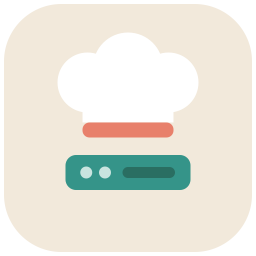

<p align="center">
  
</p>

# Chef Solo Cookbook for XCP-NG Debian VM Provisioning

Automated infrastructure provisioning using Chef Solo and cloud-init on Debian VMs running on XCP-NG hypervisor.

## Quick Start

### Prerequisites
- XCP-NG hypervisor with Debian Cloud-Init template
- Internet connectivity to GitHub
- A web server hosting the Chef deb package (rename it to `chef-latest.deb`)
- Customized cloud-init.sh for your environment

### Step 1: Customize cloud-init.sh

Edit `cloud-init.sh` and update these variables to match your environment:

```bash
# Line 27: GitHub username (for private repo access)
GITHUB_OWNER="camerongary"

# Line 29: GitHub repository name
GITHUB_REPO="chef-solo"

# Line 31: Git branch
GITHUB_BRANCH="main"

# Line 34: URL where Chef deb package is hosted
CHEF_PACKAGE_URL="http://192.168.12.249"

# Lines 50-52: Set your local username and password hash
# Generate a password hash with: openssl passwd -6
LOCAL_USERNAME="myuser"
local_user_password_hash='$6$YOUR_HASH_HERE'
```

Also update the SSH deploy key (lines 54-62) with your own GitHub deploy key.

### Step 2: Host the Chef Package

1. Download the Chef deb package (any version) from [chef.io/downloads](https://www.chef.io/downloads)
2. Rename it to `chef-latest.deb`
3. Place it on a web server (Nginx, Apache, S3, Munki, etc.)
4. Note the URL (e.g., `http://192.168.12.249/chef-latest.deb`)
5. Update `CHEF_PACKAGE_URL` in your `cloud-init.sh` to match

### Step 3: Create a Cloud Config in XCP-NG

1. Open XCP-NG web console
2. Go to **Home** → **VMs**
3. Select your pool
4. Click **New VM**
5. Select **Debian Cloud Init** from templates
6. Under **Install Settings**, click **Custom Configs** → **User config**
7. Paste the entire contents of your customized `cloud-init.sh` into the User Config field
8. Customize disk and network settings as needed
9. Click **Create**

### Step 4: Boot and Provision

1. Start the VM
2. Cloud-init will automatically:
   - Download Chef from your web server
   - Clone this repository via SSH with the deploy key
   - Run Chef Solo with all configured cookbooks
3. SSH into the VM when provisioning completes

## Development

### Linting Recipes

Validate your cookbooks with cookstyle:

```bash
cookstyle cookbooks/
```

Auto-fix correctable issues:

```bash
cookstyle cookbooks/ -a
```

### Repository Structure

```
chef-solo/
├── cookbooks/
│   ├── base/
│   │   ├── metadata.rb
│   │   └── recipes/
│   │       ├── packages.rb    (base packages, timezone)
│   │       └── users.rb       (admin/cameron users)
│   ├── docker/
│   │   ├── metadata.rb
│   │   └── recipes/
│   │       └── install.rb     (Docker CE setup)
│   └── python/
│       ├── metadata.rb
│       └── recipes/
│           └── install.rb     (Python3, pip, venv)
├── solo.rb                      (Chef Solo config)
├── solo.json                    (run list & attributes)
├── cloud-init.sh               (XCP-NG provisioning script)
└── README.md
```

### Adding Packages

Edit `solo.json` and add to the `base.packages` array:

```json
{
  "base": {
    "packages": [
      "curl",
      "wget",
      "git",
      "vim",
      "htop",
      "net-tools",
      "build-essential",
      "your-package-here"
    ]
  }
}
```

### Modifying Recipes

Edit files in `cookbooks/<cookbook>/recipes/` and commit:

```bash
git add cookbooks/
git commit -m "Update recipes"
git push
```

Next provisioned VMs will use the updated recipes automatically via cloud-init.

## Configuration

- **Chef version**: Latest (version-agnostic via `chef-latest.deb`)
- **Hypervisor**: XCP-NG
- **Template**: Debian Cloud-Init (Bullseye or Bookworm)
- **Chef hosting**: Any HTTP server (rename deb to `chef-latest.deb` before hosting)
- **Deploy key**: GitHub SSH deploy key (base64-encoded in cloud-init.sh)
- **Local user**: Customizable in cloud-init.sh (choose your own username and password)

## Customization

Before using this in your environment, you must:

1. **Update cloud-init.sh**:
   - Change `GITHUB_OWNER`, `GITHUB_REPO`, `GITHUB_BRANCH` to match your setup
   - Set `CHEF_PACKAGE_URL` to the URL where your Chef deb is hosted (must be named `chef-latest.deb`)
   - Choose a `LOCAL_USERNAME` and generate a password hash with `openssl passwd -6`
   - Generate a new GitHub deploy key and update the base64-encoded private key

2. **Update solo.json**:
   - Add/remove packages as needed
   - Customize user details in the base recipe

3. **Create a GitHub deploy key**:
   ```bash
   ssh-keygen -t ed25519 -f ~/.ssh/github_deploy -N ""
   cat ~/.ssh/github_deploy.pub  # Add this as read-only deploy key on GitHub
   cat ~/.ssh/github_deploy | base64  # Use in cloud-init.sh
   ```

## Troubleshooting

Check cloud-init logs on the VM:

```bash
tail -f /var/log/cloud-init-output.log
```

Check Chef logs:

```bash
tail -f /var/log/chef-solo.log
```

View Chef stacktrace:

```bash
cat /opt/chef-solo/cache/chef-stacktrace.out
```

## License

MIT
